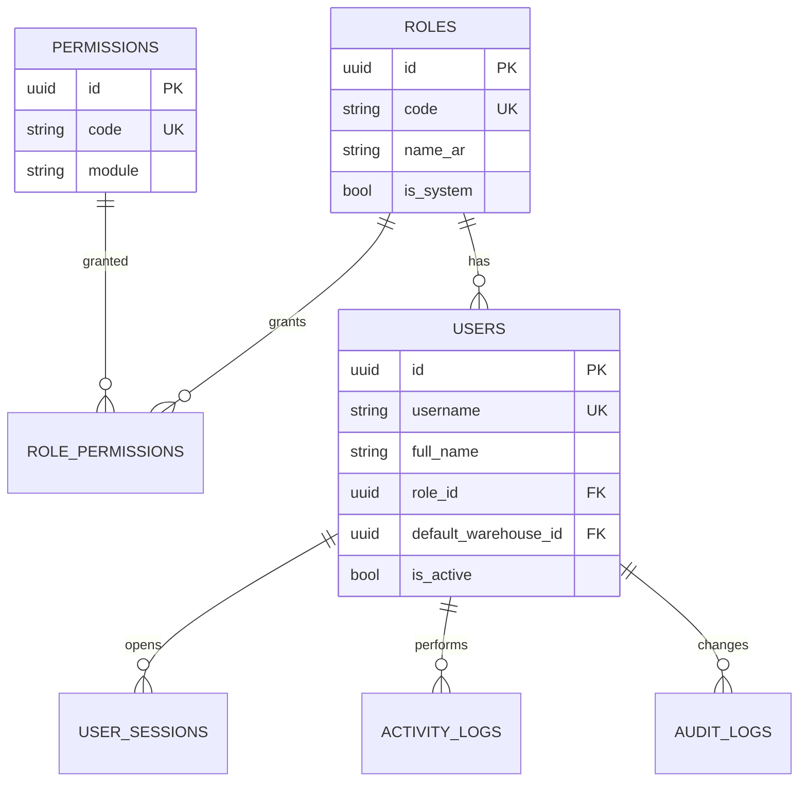
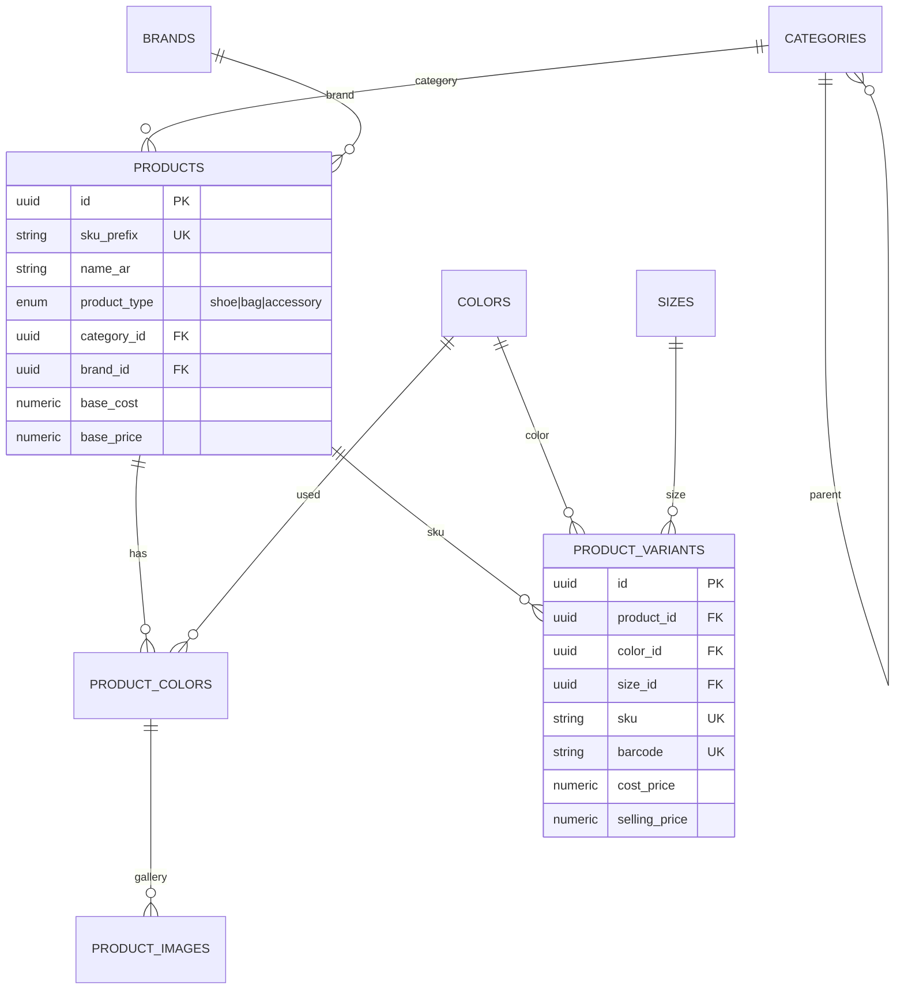
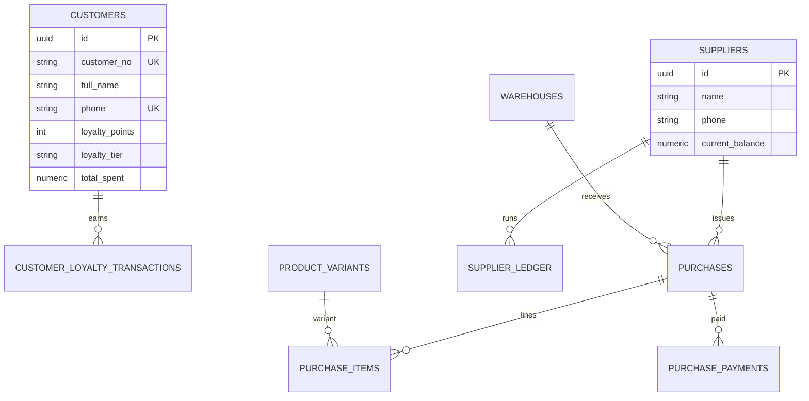
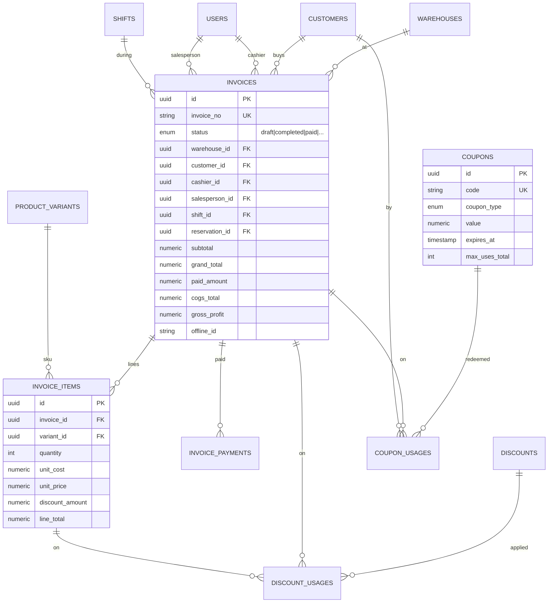
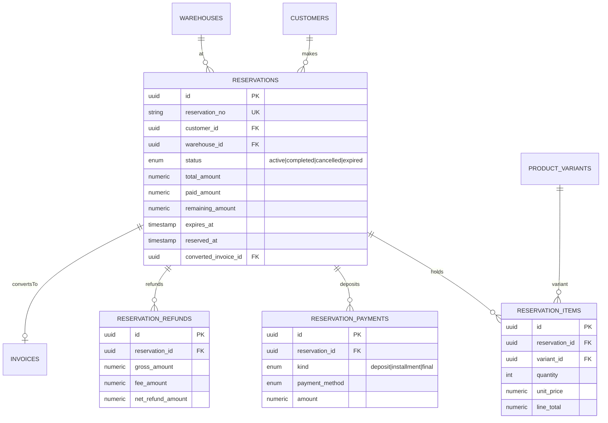
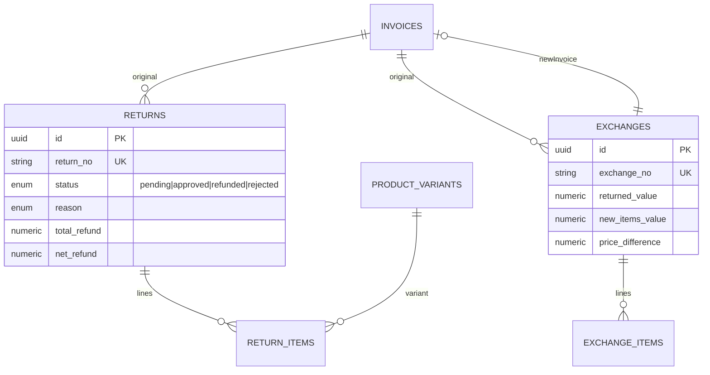
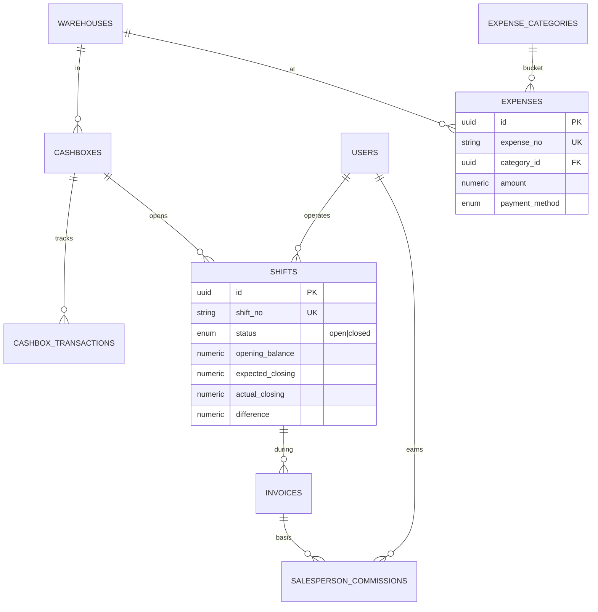
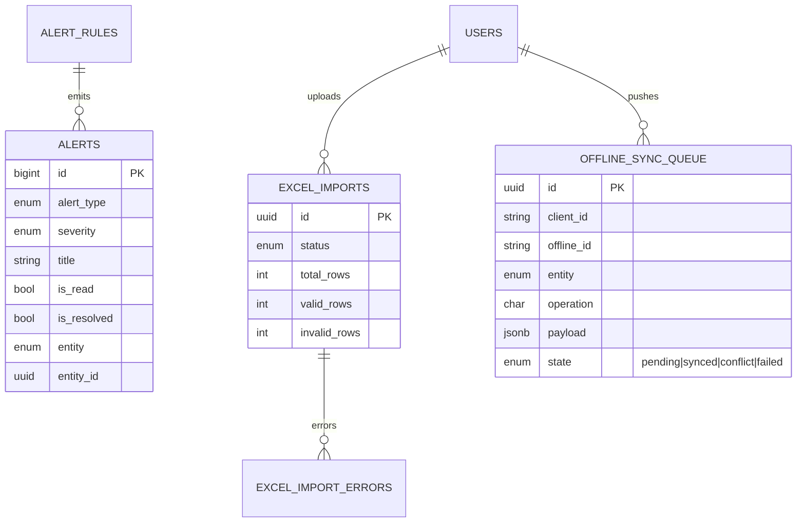
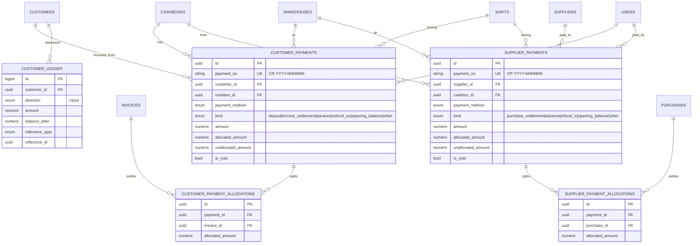

# ERD — Zahran Retail System

Entity-Relationship Diagram organized by module. View this file in any Markdown
renderer that supports Mermaid (GitHub, GitLab, VS Code, Obsidian, Notion…).

---

## 1 · RBAC & Users



## 2 · Catalog



## 3 · Inventory

```mermaid
erDiagram
    WAREHOUSES ||--o{ STOCK : holds
    PRODUCT_VARIANTS ||--o{ STOCK : of
    WAREHOUSES ||--o{ STOCK_MOVEMENTS : affects
    PRODUCT_VARIANTS ||--o{ STOCK_MOVEMENTS : variant
    WAREHOUSES ||--o{ STOCK_TRANSFERS : from
    WAREHOUSES ||--o{ STOCK_TRANSFERS : to
    STOCK_TRANSFERS ||--o{ STOCK_TRANSFER_ITEMS : lines
    WAREHOUSES ||--o{ STOCK_ADJUSTMENTS : in
    STOCK_ADJUSTMENTS ||--o{ STOCK_ADJUSTMENT_ITEMS : lines
    WAREHOUSES ||--o{ INVENTORY_COUNTS : counts
    INVENTORY_COUNTS ||--o{ INVENTORY_COUNT_ITEMS : lines

    STOCK {
        uuid id PK
        uuid variant_id FK
        uuid warehouse_id FK
        int quantity_on_hand
        int quantity_reserved
        int reorder_point
    }
    STOCK_MOVEMENTS {
        bigint id PK
        enum movement_type
        enum direction
        int quantity
        enum reference_type
        uuid reference_id
    }
```

## 4 · Customers & Suppliers & Purchases



## 5 · POS / Invoices / Discounts / Coupons



## 6 · Reservations 🔥 (Partial Payment)



## 7 · Returns & Exchanges



## 8 · Accounting & Shifts



## 9 · Alerts / Imports / Offline Sync



## 10 · Cash Desk (Customer & Supplier Payments) 💰



---

## Legend
- PK = Primary Key
- FK = Foreign Key
- UK = Unique Key
- `||--o{` = one-to-many
- `||--o|` = one-to-one (optional)
